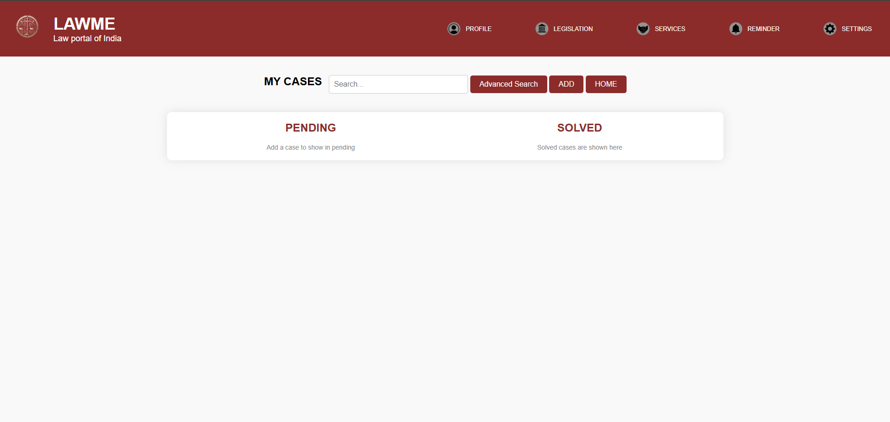

# Lawme-SIH
commercial courts website

---

````markdown
# LawMe Chatbot 🤖⚖️

LawMe is an AI-powered chatbot designed to simplify access to judicial services and legal information for users interacting with the Department of Justice (DoJ). It supports queries related to judicial appointments, case status, traffic fines, eCourts services, live court streaming, and more.

---

## 🚀 Features

- 🤝 Interactive chatbot for legal assistance
- 📚 Responds to queries about:
  - Judicial appointments
  - Fast Track Courts
  - Live court proceedings
  - Traffic fines and payment portals
  - eCourts and Tele Law services
  - Case status and court listings
- 🌐 Built for multilingual and inclusive access
- 🧠 Handles irrelevant questions with graceful fallback responses

---

## 🖼️ Screenshots

### 🧑‍⚖️ Chatbot Interface


### 📁 Case Submission & Storage


### ⚙️ MongoDB Data View


> _Note: Replace the above paths with actual image paths in your repo._

---

## 🛠️ Tech Stack

- **Frontend:** HTML, CSS, JavaScript (optional, if using a custom frontend)
- **Backend:** Node.js / Express (or Botpress backend logic)
- **Chatbot Framework:** [Botpress](https://botpress.com/)
- **Database:** MongoDB (accessed via MongoDB Compass)
- **Tools:** VS Code, Botpress Studio

---

## ⚙️ Installation & Setup

> Prerequisites:
> - Node.js installed
> - MongoDB running locally or remotely
> - Botpress installed if using its framework

1. **Clone the Repository**

```bash
git clone https://github.com/yourusername/lawme-chatbot.git
cd lawme-chatbot
````

2. **Install Dependencies**

```bash
npm install
```

3. **Start MongoDB**

Make sure MongoDB is running locally (`localhost:27017`) or update your connection string in `.env`.

4. **Run the Server**

```bash
node server.js
```

5. **Access the App**

Open your browser and go to:

```
http://localhost:3000
```

---

## 🧾 MongoDB Schema

Each case document contains:

* `caseNumber` – String (unique ID)
* `description` – Brief about the case
* `imageUrl` – Optional, image associated with case
* `documentUrl` – Optional, link to legal documents

---

## ✨ Future Enhancements

* ✅ Add multilingual NLP support
* 🔒 Role-based authentication (Admin/User)
* 📊 Analytics dashboard for usage data
* 🔌 Official DoJ API integration
* 📱 Mobile responsive chatbot UI

---

## 🤝 Contribution

Pull requests are welcome! To contribute:

1. Fork this repository
2. Create a new branch: `git checkout -b feature/your-feature-name`
3. Commit your changes
4. Push to the branch: `git push origin feature/your-feature-name`
5. Submit a pull request

---

## 📝 License

This project is licensed under the [MIT License](LICENSE).

---

Made with ❤️ to make legal access simple, by Vishal V.

